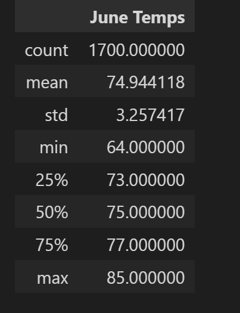
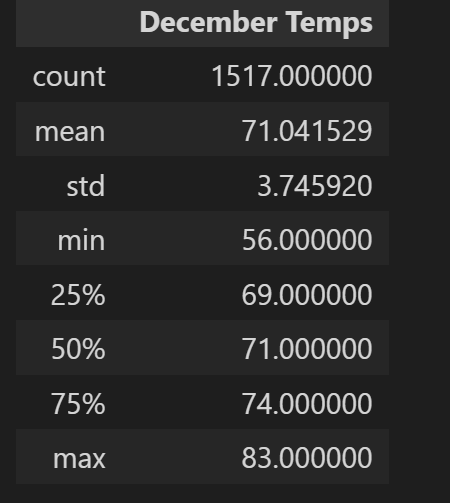

# surfs_up


## Overview

The purpose of this analysis is to use SQLAlchemy and Pandas to generate summary statistics for temperature data in the `hawaii.sqlite` database.

## Results





- June and December have similar minimum, maximum, and mean temperatures with similar standard deviation.
- June has marginally higher median and third quartile temperatures.
- Differences between the months are mostly within one standard deviation of the data for each month.

## Summary

For the most part, temperatures in Hawaii in June and December are pretty similar and within the threshold for surfing weather. One query that could help us understand weather conditions would be to query for precipitation:
```{python}
precip_jun = session.query(Measurement.prcp).filter(extract('month', Measurement.date) == 6)
precip_dec = session.query(Measurement.prcp).filter(extract('month', Measurement.date) == 12)
```
Another query would be the maximum temperatures for each station for each month, to get a sense of the spatial distribution of daytime high temperatures:
```{python}
session.query(func.max(Measurement.tobs)).filter(extract('month', Measurement.date) == 6).group_by(Measurement.station).all()
session.query(func.max(Measurement.tobs)).filter(extract('month', Measurement.date) == 12).group_by(Measurement.station).all()
```
